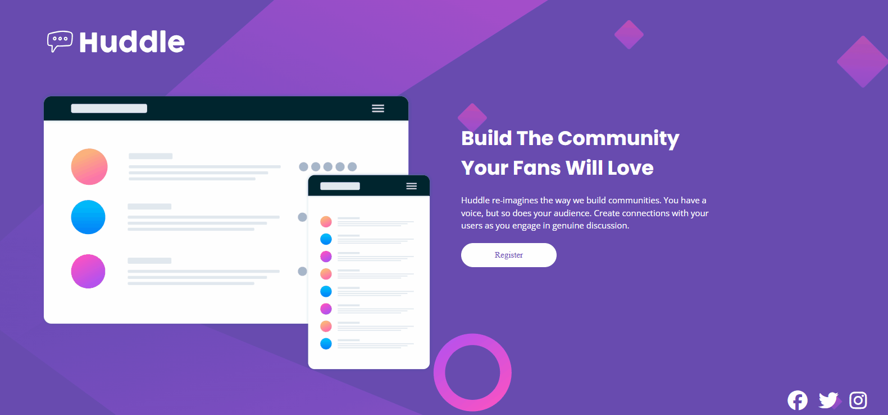
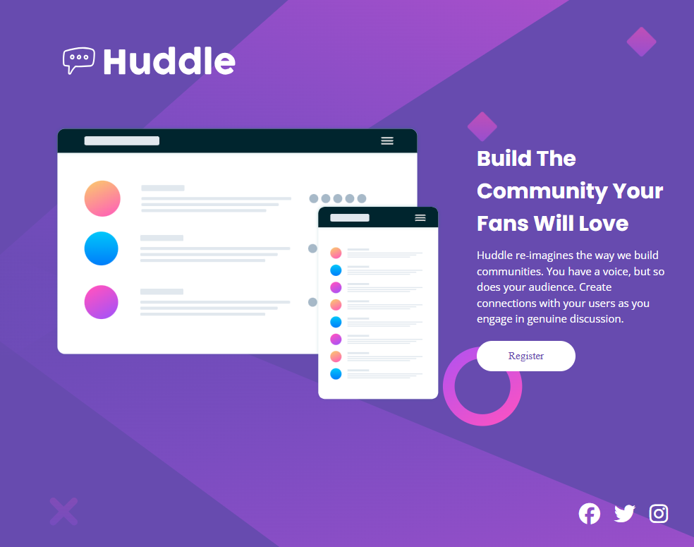
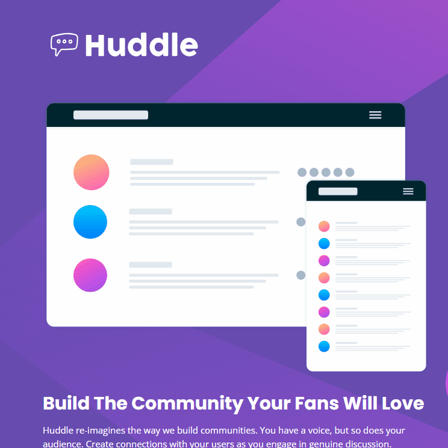
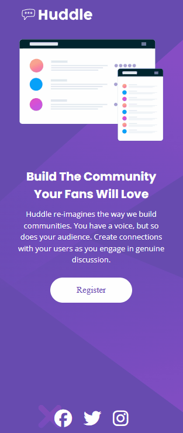

# Frontend Mentor - Solução do desafio da landing page Huddle com seção introdutória única

Esta é a minha solução para o desafio [Huddle landing page with single introductory section challenge on Frontend Mentor](https://www.frontendmentor.io/challenges/huddle-landing-page-with-a-single-introductory-section-B_2Wvxgi0) do Frontend Mentor. Os desafios do Frontend Mentor ajudam a aprimorar habilidades de codificação através da criação de projetos realistas e focados em boas práticas de desenvolvimento.

## 🗂️ Índice

- [Visão Geral](#visão-geral)
  - [Capturas de Tela](#capturas-de-tela)
  - [Links](#links)
- [Meu Processo](#meu-processo)
  - [Construído com](#construído-com)
  - [O que Aprendi](#o-que-aprendi)
  - [Desenvolvimento Contínuo](#desenvolvimento-contínuo)
  - [Desafios que Encontrei](#desafios-que-enfrentei)
- [Autor](#autor)
- [Contato](#contato)

---

## Visão Geral 

### Capturas de Tela
#### Layout para Web/desktop:

  

#### Layout para tablet:

  

  

#### Layout para celulares:

  

### Links

- URL do site publicado: [Clique aqui](https://guilherme-ddiniz.github.io/Solu-o-do-desafio-da-landing-page-Huddle-com-se-o-introdut-ria-nica/)

---

## Meu Processo 

### Construído com

- HTML5 semântico
- CSS3 com propriedades personalizadas (CSS Variables)
- Flexbox e CSS Grid para layout responsivo
- Fluxo de trabalho Desktop-first
- Controle de versão com Git

### O que Aprendi

- Este foi um projeto simples, cujo principal objetivo foi colocar em prática meus conhecimentos em HTML5 e CSS3. Além disso, a conclusão deste desafio foi importante por fazer parte do curso DevQuest, que estou realizando no momento desta publicação.

### Desenvolvimento Contínuo

- Tenho o objetivo de continuar aprimorando constantemente minhas habilidades em HTML, CSS, Git e GitHub, já me preparando para o próximo desafio, que marcará o início da minha jornada com JavaScript.

---

## Autor

- GitHub - [Guilherme-dDiniz](https://github.com/Guilherme-dDiniz)
- Frontend Mentor - [@Guilherme-dDiniz](https://www.frontendmentor.io/profile/Guilherme-dDiniz)

- Linkedln - [Guilherme Diniz](www.linkedin.com/in/guilherme-diniz-dev-web)
